class: middle, center, title-slide

# Deep latent variable models

TRAIL doctoral seminars

November 5, 2021

  
Prof. Gilles Louppe 
[g.louppe@uliege.be](mailto:g.louppe@uliege.be)

---

class: middle

.center.circle.width-30[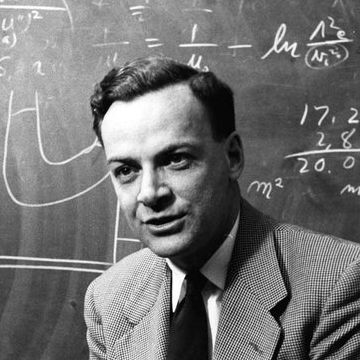]

.italic.center["What I cannot create, I do not understand."]

.pull-right[Richard Feynman]

---

class: middle

A **generative model** is a probabilistic model $p$ that can be used as *a simulator of the data*.
Its purpose is to generate synthetic but realistic high-dimensional data
$$\mathbf{x} \sim p(\mathbf{x};\theta),$$
that is as close as possible from the unknown data distribution $p(\mathbf{x})$.

---

class: middle 

## Why generative models

.center[
.width-100[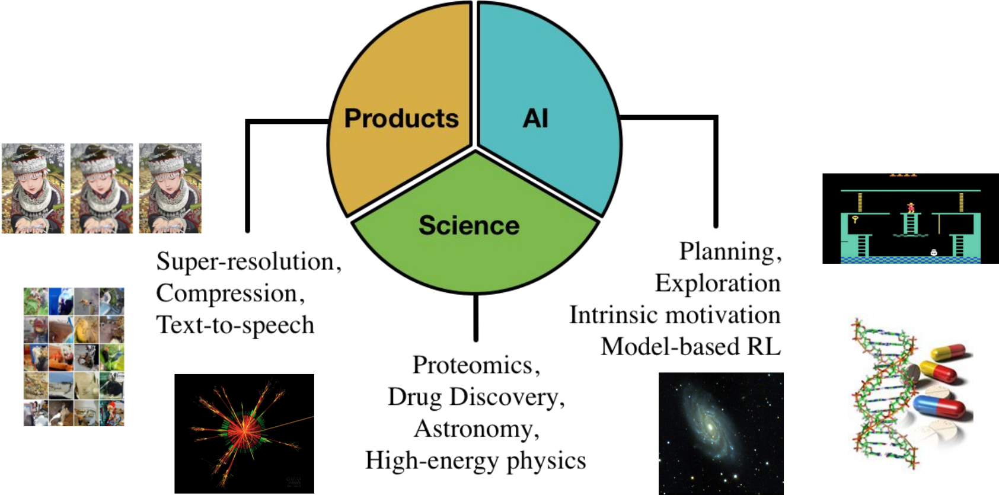]

Generative models have a role in many important problems]

---

count: false
class: middle

# Part I: Variational inference

---

class: middle, black-slide

.center[<video controls autoplay loop muted preload="auto" height="480" width="640">
  <source src="./figures/lec9/galton.mp4" type="video/mp4">
</video>]

---

class: middle, center

See blackboard.

---

count: false
class: middle

# Part II: Variational auto-encoders

---

class: middle, center

See blackboard.

---

class: middle, center

See code example 1.

---

# Examples

Consider as data $\mathbf{d}$ the MNIST digit dataset:

.center.width-100[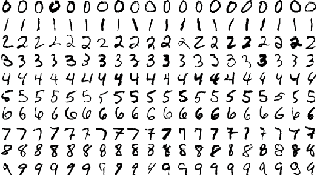]

---

class: middle, center

.width-100[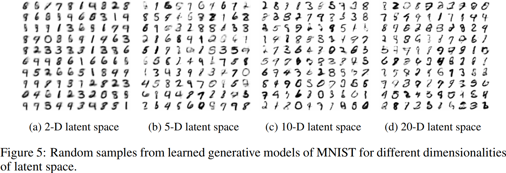]

(Kingma and Welling, 2013)

---

class: middle, center

.width-100[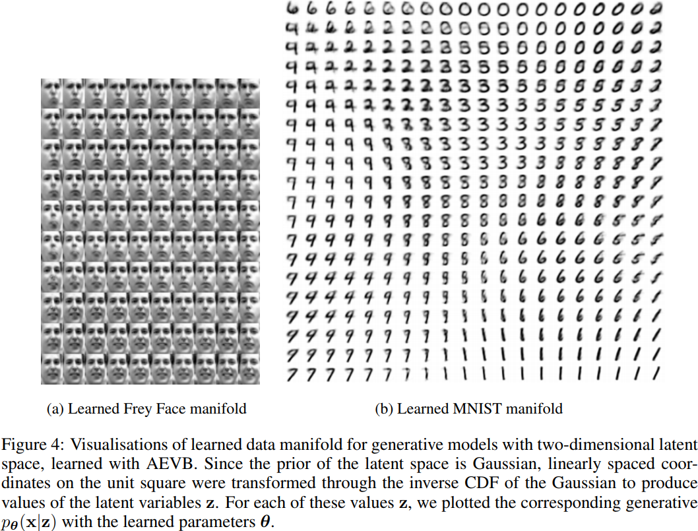]

(Kingma and Welling, 2013)

---

class: middle

.center[
.width-100[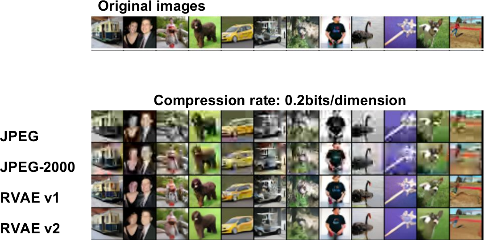]

Hierarchical .bold[compression of images and other data], e.g., in video conferencing systems (Gregor et al, 2016).
]

---

class: middle

.center[
.width-100[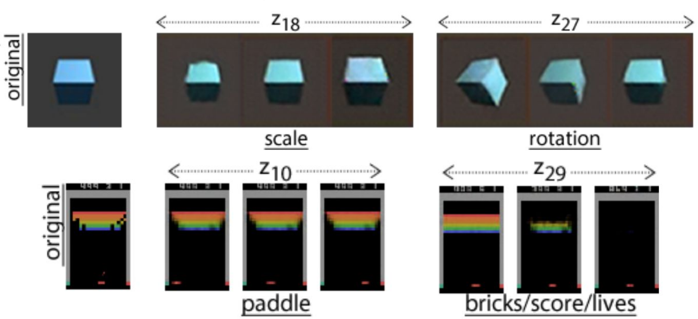]

.bold[Understanding the factors of variation and invariances] (Higgins et al, 2017).
]

---

class: middle 

.center[

.width-80[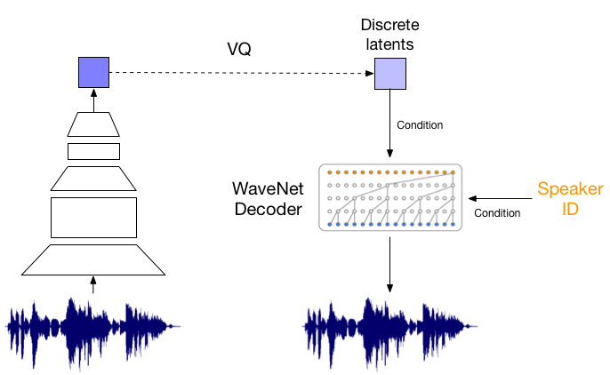]

.bold[Voice style transfer] [[demo](https://avdnoord.github.io/homepage/vqvae/)] (van den Oord et al, 2017).
]

---

class: middle

.center.width-100[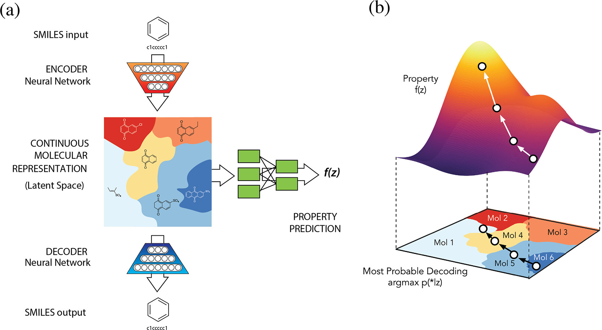]

.center[.bold[Design of new molecules] with desired chemical properties (Gomez-Bombarelli et al, 2016).]

---

class: middle, black-slide

.center[

<iframe width="640" height="400" src="https://www.youtube.com/embed/Wd-1WU8emkw?&loop=1&start=0" frameborder="0" volume="0" allowfullscreen></iframe>

Bridging the .bold[simulation-to-reality] gap (Inoue et al, 2017).

]

---

count: false
class: middle

# Part III: Hierarchical VAEs

---

class: middle, center

See blackboard.

---

class: middle

.center.width-90[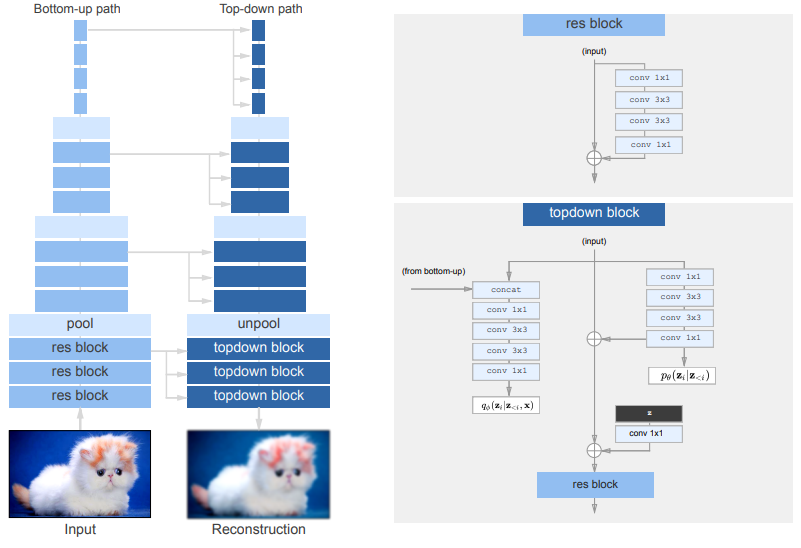]

.center[VDVAE: Very Deep VAEs (Child, 2020-2021).]

---

class: middle

.center.width-70[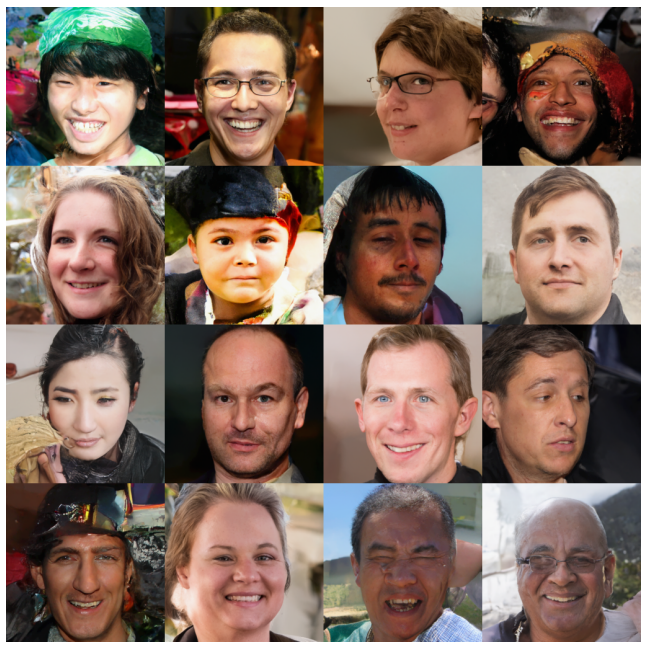]

.center[VDVAE samples (Child, 2020-2021).]

---

class: middle

.center.width-100[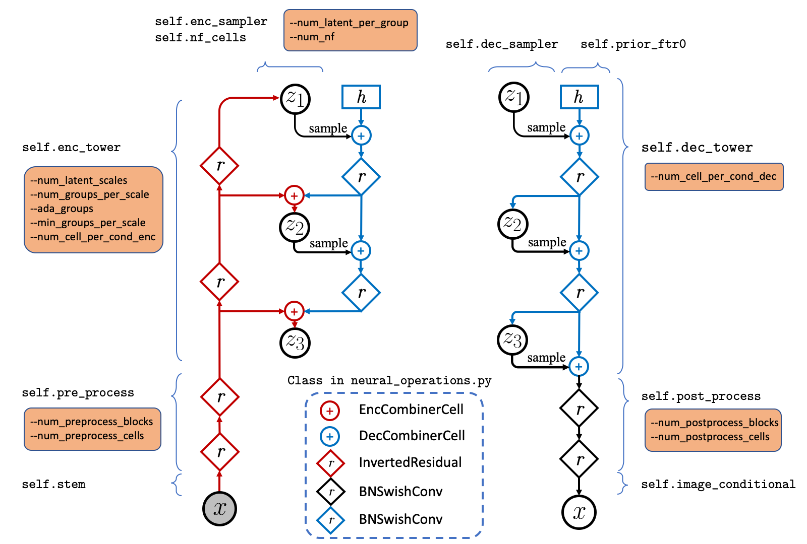]

.center[NVAE: A Deep Hierarchical Variational Autoencoder (Vahdat and Kautz, 2020).]

---

class: middle

.center.width-90[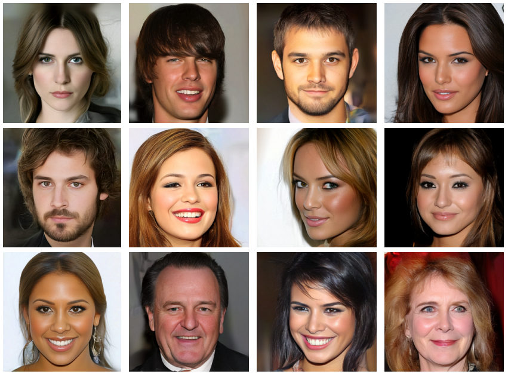]

.center[NVAE samples (Vahdat and Kautz, 2020).]

---

class: black-slide, middle

.center[
.width-60[]

NVAE: Random walks in latent space. (Vahdat and Kautz, 2020)

]

---

count: false
class: middle

# Part IV: Denoising diffusion probabilistic models

---

class: middle, center

See blackboard.

---

class: middle

.center.width-100[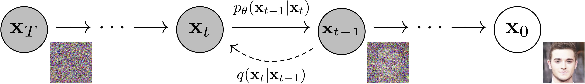]

.center[Denoising Diffusion Probabilistic Models (Ho et al, 2020).]

---

class: middle

.center.width-100[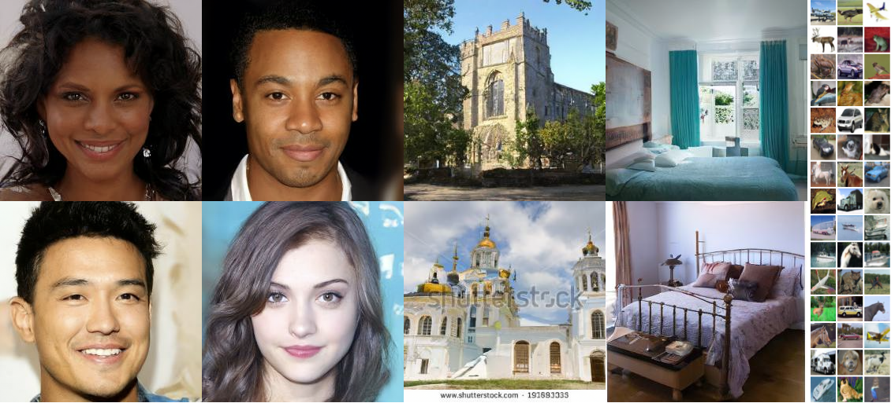]

.center[DDPM samples (Ho et al, 2020).]

---

class: middle

.center.width-100[]

.center[Score-based generative modeling through SDEs (Song et al, 2021).]

---

class: middle

.center.width-100[]

.center[Perturbing data with an SDE (Song et al, 2021)]

---

class: middle

.center.width-100[]

.center[Reversing the SDE for sample generation (Song et al, 2021)]

---

class: middle

.center.width-100[]

.center[(Song et al, 2021)]

---

count: false
class: middle

# Part V: Priors

---

class: middle, center

See blackboard.

---

class: middle

.center.width-100[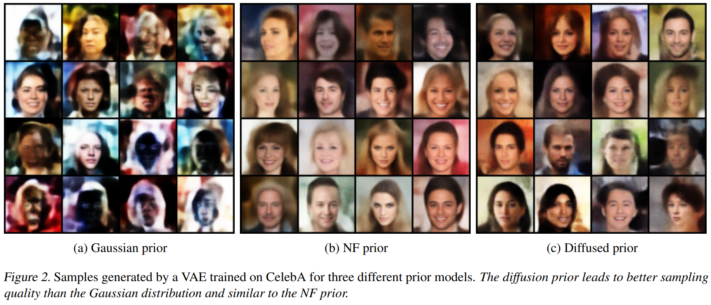]

.center[Diffusion priors in VAEs (Wehenkel and Louppe, 2021).]

---

class: middle

.center.width-100[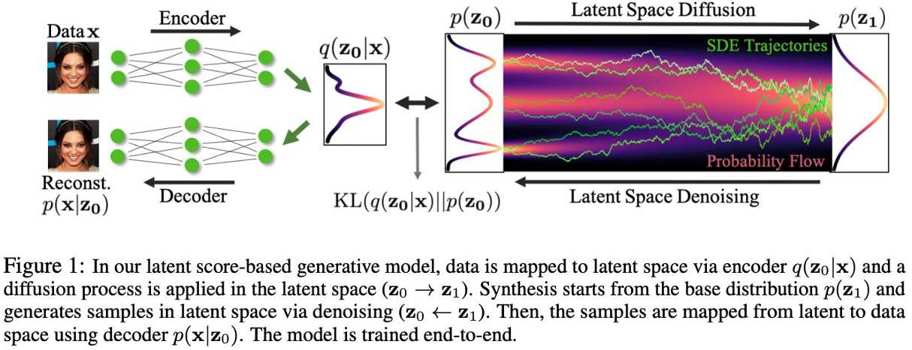]

.center[LSGM: Latent Score-based Generative Model (Vahdat et al, 2021).]

---

class: middle

.center.width-100[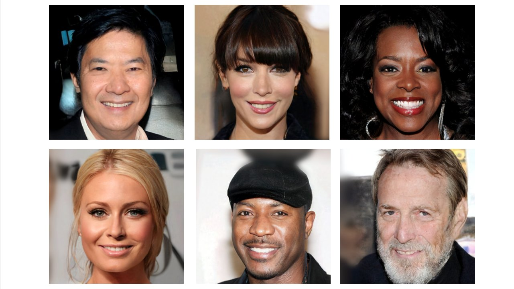]

.center[LSGM samples (Vahdat et al, 2021).]

---

class: end-slide, center
count: false

The end.
